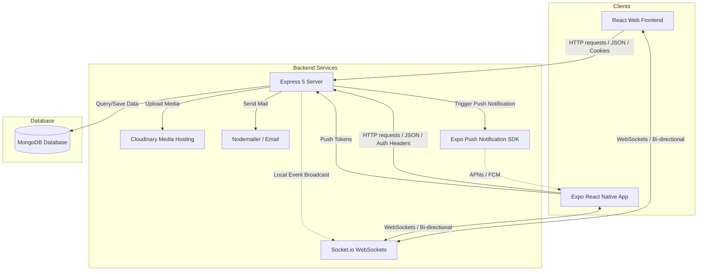
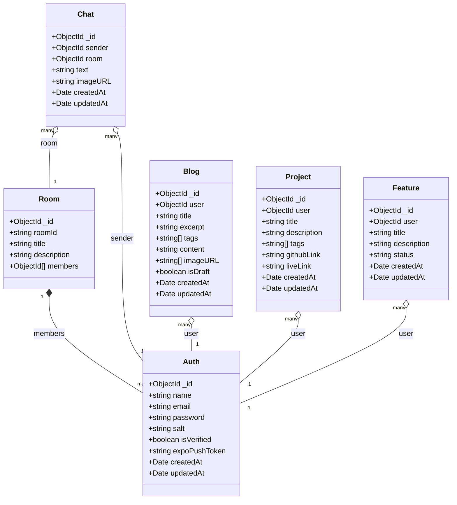

# Project Analysis: Anime Club NITH

Anime Club NITH is a comprehensive, real-time communication platform designed for anime enthusiasts. It facilitates connection, discussion, and collaboration through dedicated chat rooms, providing a seamless experience across web and mobile interfaces.

This document provides a detailed technical analysis of the Anime Club NITH codebase, covering its architecture, database models, API routes, real-time WebSocket mechanism, frontend/mobile components, and code recommendations.

---

## 1. Overall System Architecture

Anime Club NITH is organized as a **monorepo** with three primary directories:
1. **`backend/`**: A Node.js & Express 5 API server, MongoDB/Mongoose database driver, and Socket.io server.
2. **`frontend/`**: A React 19 web app bundled with Vite 7 and styled with Tailwind CSS 4.
3. **`mobile/`**: A React Native cross-platform mobile application built with Expo 54 and React Navigation 7.

### Architecture & Data Flow Diagram



---

## 2. Technical Stack

| Component | Technology | Primary Libraries & Frameworks | Description |
| :--- | :--- | :--- | :--- |
| **Backend** | Node.js, TypeScript | Express 5, Mongoose, Socket.io, Cloudinary SDK, Expo Server SDK, Nodemailer, JSON Web Token | Manages users, chat logging, Cloudinary image uploads, email verification, and websocket routing. |
| **Web Frontend** | React 19, TypeScript | Vite 7, Tailwind CSS 4, Socket.io Client, GSAP & Lenis, React Markdown, Axios | Responsive web app with smooth animations, custom scrolling, markdown support, and real-time chat. |
| **Mobile App** | React Native, TypeScript | Expo 54, React Navigation 7, AsyncStorage, Socket.io Client, Expo Image Picker / Notifications | Cross-platform mobile app featuring push notifications, image sharing, and channel browsing. |

---

## 3. Database Schema Design (Mongoose Models)

Anime Club NITH leverages MongoDB for persistence, defining schemas via Mongoose in `backend/models/`.



### Detailed Field Definitions

1. **`Auth`** (`auth.ts`):
   - `name` (String, required)
   - `email` (String, required, unique)
   - `password` (String, required) - hashed password
   - `salt` (String) - unique salt per user
   - `isVerified` (Boolean, default: `false`)
   - `expoPushToken` (String, default: `null`) - registered mobile token for push notifications

2. **`Room`** (`room.ts`):
   - `roomId` (String, required, unique) - e.g., slug like `"general"`
   - `title` (String, required, unique) - human readable name like `"General Discussion"`
   - `description` (String, required)
   - `members` (Array of ObjectIds, ref: `Auth`)

3. **`Chat`** (`chat.ts`):
   - `sender` (ObjectId, ref: `Auth`, required)
   - `room` (ObjectId, ref: `Room`, required, indexed)
   - `text` (String)
   - `imageURL` (String, default: `" "`)

4. **`Blog`** (`blog.ts`):
   - `user` (ObjectId, ref: `Auth`) - author
   - `title` (String, required)
   - `excerpt` (String, required)
   - `tags` (Array of Strings)
   - `content` (String, required) - Markdown content
   - `imageURL` (Array of Strings) - Cover / inline images uploaded to Cloudinary
   - `isDraft` (Boolean, default: `false`)

5. **`Project`** (`project.ts`):
   - `user` (ObjectId, ref: `Auth`) - creator
   - `title` (String, required)
   - `description` (String, required)
   - `tags` (Array of Strings)
   - `githubLink` (String, required)
   - `liveLink` (String)

6. **`Feature`** (`feature.ts`):
   - `user` (ObjectId, ref: `Auth`) - proposer
   - `title` (String, required, unique)
   - `description` (String, required)
   - `status` (String, required) - e.g., `"Proposed"`, `"In Progress"`, `"Completed"`

---

## 4. API Endpoints

### Authentication `/api/auth`
- **`POST /signup`**: Registers a user, hashes password, saves as unverified, and sends account verification email via Nodemailer.
- **`GET /verify-email?hash=...`**: Decodes JWT verification token, marks user `isVerified = true`, and issues login token cookie.
- **`POST /login`**: Validates credentials and responds with a JWT cookie (`token`) and user object.
- **`POST /forget-password-via-old`**: Updates password given email, old password, and new password.
- **`POST /forget-password-via-email`**: Triggers a recovery email with a reset link.
- **`POST /change-password?token=...`**: Decodes password reset JWT token and applies the new password.
- **`POST /logout`**: Clears the authentication token cookie.

### Room Management `/api/room` *(Requires Auth)*
- **`POST /create`**: Initializes a new room.
- **`GET /all-rooms`**: Fetches list of all chat rooms.
- **`GET /:roomId`**: Returns metadata and members for a specific room (queries by Mongo ObjectId or unique slug `roomId`).
- **`POST /join/:roomId`**: Adds the authenticated user to the room's members list.

### Chat & Messaging `/api/chat` *(Requires Auth)*
- **`POST /:roomId`**: Accepts optional text body and optional multipart image attachment. 
  1. Uploads media to Cloudinary.
  2. Saves chat entry to MongoDB.
  3. Emits message event (`receive_message`) to the active Socket.io room.
  4. Delivers offline push notifications to room members via the Expo SDK.
- **`GET /chat-history/:roomId?page=X`**: Fetches paginated chat history (20 messages per page), populated with sender names and avatars.

### Blogs `/api/blog`
- **`GET /`**: Fetches all published blogs (`isDraft: false`).
- **`POST /`**: Publishes a new blog post. Supports multipart image files.
- **`POST /upload-image`**: Standalone endpoint to upload blog media to Cloudinary.
- **`GET /:blogId`**: Fetches details for a single blog post.
- **`GET /user/:userId`**: Gets all blogs created by a specific user.
- **`PUT /:blogId`**: Updates a blog post.
- **`DELETE /:blogId`**: Removes a blog post.

### Project Showcase `/api/project`
- **`GET /`**: Fetches all projects.
- **`POST /`**: Uploads new project details.
- **`GET /:projectId`**: Fetches a single project.
- **`PUT /:projectId`**: Edits project links and details.
- **`DELETE /:projectId`**: Deletes project entry.

---

## 5. Real-time Message Orchestration

Anime Club NITH implements a hybrid architecture to achieve high reliability and low latency:
1. **HTTP POST for Sending**: New messages are sent using HTTP multipart requests (`POST /api/chat/:roomId`), enabling clean handling of large text payloads and binary images (streamed to Cloudinary directly from memory via Multer buffers).
2. **WebSocket for Receiving**: Once the backend controller successfully handles the POST request and writes the entry to MongoDB, it accesses the global Socket.io instance and emits the saved document to the specific room ID:
   ```typescript
   io.to(roomId).emit("receive_message", populatedMessage);
   ```
3. **Smart Push Notifications**: To save power and avoid redundant notifications:
   - The backend checks which users are connected to the socket room.
   - It filters out the sender and any users who are **already active** in the socket channel.
   - It delivers an Expo push notification only to the **inactive/offline** members of that room.

> [!NOTE]
> In `backend/services/socket.ts`, the websocket event listener `send_message` simply logs the incoming payload:
> ```typescript
> socket.on('send_message', async (data: sendMessagePayload) => {
>     console.log(`Message received: ${data}`);
> });
> ```
> Since sending is driven by REST endpoints, the clients do not push chat events via websocket connections. However, web and mobile clients listen to the `"receive_message"` event from the socket connection to receive incoming messages in real-time.

---

## 6. Frontend (React Web Application)

The frontend uses standard React page layouts and rendering pipelines.

- **Main Navigation (`App.tsx`)**: Built using `react-router-dom` v7. Includes routes for Home, Login/Signup, Room Chat Interface (`/room` and `/room/:roomId`), and Markdown blogs.
- **GSAP & Smooth Scrolling**: Features `lenis` smooth scroll integration paired with `gsap` scroll triggers in the `HeroSection.tsx` and `TechStack.tsx` components to present interactive animations.
- **Components Structure**:
  - `ChatWindow.tsx`: Contains the core messaging layout. Integrates `emoji-picker-react` for message reactions, renders date boundaries, displays message history, and supports text or code snippets.
  - `RoomSidebar.tsx`: Allows users to navigate between active channels and create new ones.
  - `TechStack.tsx`, `ShowCase.tsx`, `ProposedFeatures.tsx`: Informative widgets showing system metrics, member projects, and community-requested features.

---

## 7. Mobile App (Expo / React Native)

The mobile client is built on top of Expo Go.

- **Storage Cache**: Uses `@react-native-async-storage/async-storage` to store JWT credentials, providing seamless auto-login on startup.
- **Dynamic Input**: The input bar adjusts its position using `Animated` values hooked to platform-specific keyboard triggers (`keyboardWillShow` / `keyboardDidShow`).
- **Modals**: Renders full-overlay screens for file attachment select (`AttachmentModal`), syntax code editor (`CodeSnippetModal`), room roster lists (`MembersModal`), and full-screen image zooms.
- **State Flow**:
  - Automatically joins the active socket room on screen focus.
  - Dedupes messages to ensure events received via socket do not conflict with immediate HTTP client responses.

---

## 8. Branding & Asset Pipeline

Anime Club NITH features custom-tailored branding elements designed to maintain a consistent aesthetic across all client implementations.

### Branding Assets Hierarchy

The branding assets consist of four distinct layout variants of the official logo:
1. **Dark Logo (`logo-dark.png` / `logo-3.png`)**: High-contrast, dark-background logo optimized for dark mode themes.
2. **Light Logo (`logo-light.png` / `logo-2.png`)**: Vibrant-colored logo tailored for clean, light backgrounds.
3. **Vertical Logo (`logo-vertical.png` / `logo-4.png`)**: Portrait-oriented banner configuration displayed in high resolution in the website's main Hero Section.
4. **Horizontal Logo (`logo-horizontal.png` / `logo-1.png`)**: Landscape-oriented configuration utilized for wide layout interfaces.

### Cross-Platform Asset Propagation

The logo update workflow propagates assets dynamically to both platforms:
- **Web Frontend**: Assets reside under `frontend/public/` and are automatically bundled into `frontend/dist/` during Vite production compilation (`npm run build`).
- **Mobile Application**: The Expo mobile client references its assets from `mobile/assets/` (e.g. `icon.png`, `adaptive-icon.png`, `splash-icon.png`, and `favicon.png`).
  - Running `npx expo prebuild --platform android` processes the update and automatically builds the corresponding mipmap launcher graphics and launcher splash resources in the native Android container `./android`.
  - Compiling the Android package via Gradle wrapper (`./gradlew assembleRelease`) packages the updated logos inside a fresh compilation of the mobile app (`app-release.apk`), which is then served directly from the website's public download path.

---

## 9. Recommendations & Code Improvements

1. **Standardize Socket Events**:
   Align the backend websocket receive event with frontend expectations. Clean up the unused `send_message` listener on the socket server or completely transition to socket-based message delivery if REST POST request overhead becomes a bottleneck.
2. **Consolidate Duplicate Types**:
   Extract shared model interfaces (e.g., `Message`, `Room`, `User`) into a shared types directory in the root of the monorepo to reduce duplicate type declarations between `frontend/src`, `backend/types`, and `mobile/types`.
3. **Cloudinary Asset Optimization**:
   Leverage Cloudinary's dynamic URL transformations (e.g., cropping, resolution scaling, and auto-format/auto-quality params like `f_auto,q_auto`) on the frontend to deliver responsive, optimized images for both web and mobile clients.

